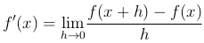
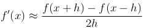

# Derivative Error

## Background

The limit definition of the derivative (in one dimension) is often used to compute derivatives by hand.

However, when symbolic math cannot be done, and infinite precision is not available, this method of computing derivatives can become very inaccurate. It is an ill-conditioned problem: As *h* approaches infinity, both the numerator and denominator go to 0, assuming that *f* is differentiable. This produces unstable numerical results due to the finite precision of floating-point arithmetic (In this case, IEEE 754 double-precision). Errors can be introduced by *x* not being exactly representable (The same is true for *h*, but one can restrict *h* to numbers exactly representable), the evaluation of *f*, and the arithmetic involved in the difference quotient itself. Additionally, when $h$ becomes too small, *f(x+h)-f(x)* will round to 0. Thus, the limit of the difference quotient cannot be used. Instead, we use a suitably small value of *h*. The smaller *h* is, the smaller the sampling error in the computed *f'(x)* will be, but the larger it is, the smaller the error from finite-precision arithmetic will be. Thus, we aim to find the value of *h* that will minimize the sum of these errors.

A simple step to reduce the sampling error is to use the centered difference quotient, given by:

As an example, here are the absolute errors between the computed and exact derivatives of *cos(1)* with varying choices of *h*, for both the forwards and centered difference quotients. The red square indicates the calculated optimal choice of *h*, the green line is the error function (note that it represents an upper bound), and the blue dots are the actual error at several points. All of the computations are available in the accompanying code.

The centered difference quotient is indeed more accurate, as shown above.

## About

The images used are all my own work. This was built to accompany a final paper for a numerical analysis/computation class.

## Instructions

### Prequisites

* Matlab (2015a known working) **or** GNU Octave (4.0.0 known working)

Older versions of either program will probably work too

### Usage

1. Run derivative.m
2. Follow and respond to command line prompts
3. View error graph

## Known Issues

* Horribly user-unfriendly in how new functions must be added
* Error plots may not use reasonable axis limits

## Author

Dexter Tong

## License

GNU GPL, v3.0